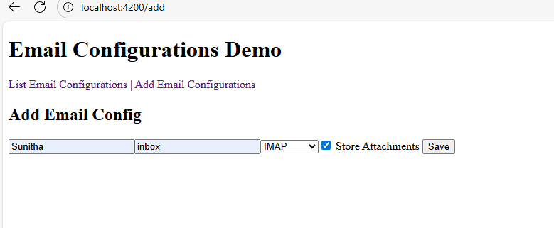
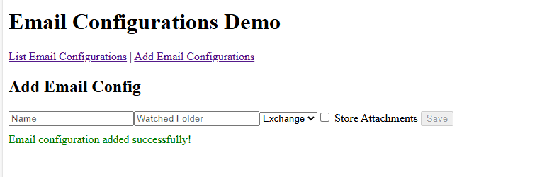

# 📧 Email Configuration App

A fullstack demo project built with **Angular 20** and **ASP.NET Core (.NET 8)** using **Entity Framework Core** and **SQLite**. It allows users to manage email configurations with a simple UI and RESTful backend.

---

## 🛠 Tech Stack

- **Frontend**: Angular 21 (standalone components, signals)
- **Backend**: ASP.NET Core (.NET 8)
- **ORM**: Entity Framework Core
- **Database**: SQLite (local file-based)
- **API Style**: RESTful (3 endpoints)
- **Security**: CORS whitelist

---


## 📁 Folder Structure

```text
EMAILCONFIGURATION/
├── frontend/                  # Angular 20 app
│   ├── src/app/
│   │   ├── components/        # add-config, list-configs, detail-config
│   │   ├── services/          # API service
│   │   ├── pipe/              # custom pipes
│   │   └── app.*              # root config files
│   └── environment.ts         # backend URL config
└── EmailConfigAPI/            # ASP.NET Core backend
    ├── Controllers/           # EmailConfigsController
    ├── Models/                # AppDbContext, EmailConfiguration
    ├── appsettings.json       # add frontend url here
    └── emailconfigs.db        # SQLite database


## ✅ Assumptions

- `Name` and `WatchedFolder` fields are **required only when both are filled**.
- The **Save** button is enabled **only when both fields are valid**.
- No complex validation or nested forms — kept simple for demo clarity.

---

## 🔌 REST API Overview

1. `GET /api/emailconfigs`  
   → Fetch all email configurations.

2. `POST /api/emailconfigs`  
   → Add a new configuration.

3. `GET /api/emailconfigs/{id}`  
   → Fetch details of a specific configuration.

   ## 🔄 Code Flow

### Frontend
- `add-config` component handles form input and validation.
- `email-config.service.ts` makes HTTP calls to backend.
- Signals are used for reactive state (success/error messages).
- Routing is minimal: add, list, and detail views.

### Backend
- `EmailConfigsController.cs` exposes 3 endpoints.
- `AppDbContext.cs` manages EF Core DB context.
- SQLite DB is auto-created via EF migrations.
- `appsettings.json` holds DB path and CORS whitelist.

## ⚙️ Setup Instructions

### Backend
```bash
cd EmailConfigAPI
dotnet restore
dotnet ef database update
dotnet run

### Frontend
cd frontend
npm install
ng serve
```
⚠️ Notes
1. Change Backend URL
Update frontend/src/environments/environment.ts:

2. Please update Frontend URL in appsettings.json

## 📊 Results

<table> <tr> <!-- Left: Output 1 --> <td>  </td>
<!-- Right: Output 2 and 3 stacked -->
<td>
  <br/>
  
</td>
</tr> </table>
